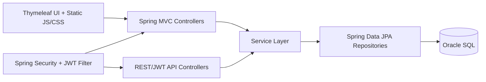

# Application Architecture

## Layers

- Controller layer: handles web pages and REST endpoints.
- Service layer: business rules (authorization checks, feed, notifications).
- Repository layer: persistence queries and specifications.
- Security layer: form login for web + JWT for `/api/**`.

