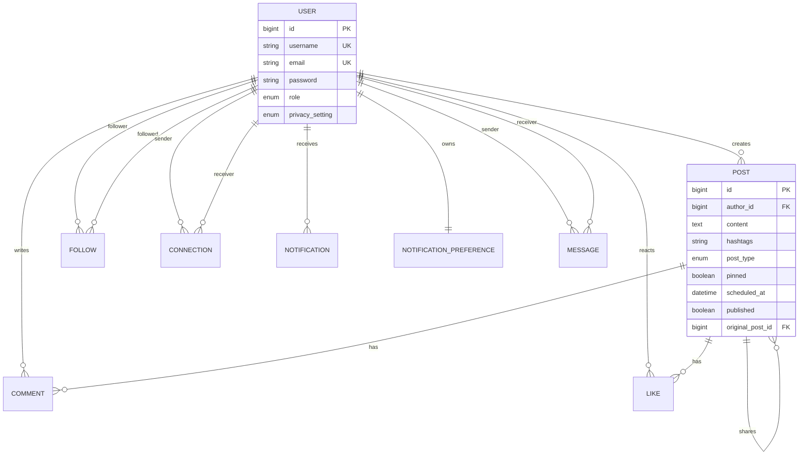

# Entity Relationship Diagram (ERD)

```mermaid
erDiagram
    USER ||--o{ POST : creates
    USER ||--o{ COMMENT : writes
    USER ||--o{ LIKE : reacts
    USER ||--o{ FOLLOW : follower
    USER ||--o{ FOLLOW : followed
    USER ||--o{ CONNECTION : sender
    USER ||--o{ CONNECTION : receiver
    USER ||--o{ NOTIFICATION : receives
    USER ||--|| NOTIFICATION_PREFERENCE : owns
    USER ||--o{ MESSAGE : sender
    USER ||--o{ MESSAGE : receiver

    POST ||--o{ COMMENT : has
    POST ||--o{ LIKE : has
    POST ||--o{ POST : shares

    USER {
      bigint id PK
      string username UK
      string email UK
      string password
      enum role
      enum privacy_setting
    }

    POST {
      bigint id PK
      bigint author_id FK
      text content
      string hashtags
      enum post_type
      boolean pinned
      datetime scheduled_at
      boolean published
      bigint original_post_id FK
    }
```

